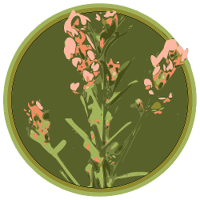

# Prairie Bush Clover SNA Data

## Data API

TBD

## Web App

TBD

## Resources

* [Minnesota Department of Natural Resources](http://www.dnr.state.mn.us/index.html)
* [Minnesota Scientific & Natural Areas](http://www.dnr.state.mn.us/snas/index.html)
* [Prairie Bush Clover SNA](http://www.dnr.state.mn.us/snas/detail.html?id=sna01036)
  * [Project on iNaturalist](https://www.inaturalist.org/projects/prairie-bush-clover-sna-data)
  * [Twitter account](https://twitter.com/PBCSNA)
  * [Bird song set on Xeno-Canto.org](http://www.xeno-canto.org/set/1054)
* [Coteau Moraines Subsection](http://www.dnr.state.mn.us/ecs/251Bb/index.html)
* [Prairie Bush Clover Fact Sheet](http://www.fws.gov/midwest/endangered/plants/prairieb.html)

